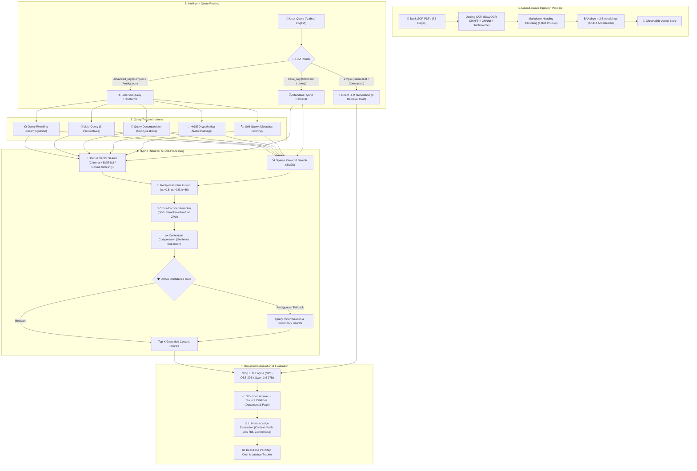

# 📄 Bank_Guide_AI — Bilingual Banking SOP Knowledge Assistant

<div align="center">

[](https://python.org)
[](https://langchain.com)
[](https://streamlit.io)
[](https://groq.com)
[](https://trychroma.com)
[](https://github.com/dorianbrown/rank_bm25)
[](https://developer.nvidia.com/cuda-zone)
[](Bank_Guide_AI_Documentation.docx)

**An enterprise-grade, GPU-accelerated Advanced Retrieval-Augmented Generation (RAG) system with Dynamic Routing, 5 Query Transformations, Hybrid Search (Dense + BM25 via RRF), Cross-Encoder Reranking, CRAG, and LLM-as-a-Judge Evaluation, specifically engineered for bilingual (Arabic & English) banking Standard Operating Procedures (SOPs).**

</div>

---

## 🌟 Overview

**Bank_Guide_AI** empowers bank personnel, auditors, and compliance officers to instantly search, verify, and understand complex banking procedures. The system bridges the linguistic and semantic gap between Arabic procedural documentation and bilingual queries, returning concise, structured answers backed by verifiable document names and page-level citations.

### 📚 Ingested Knowledge Base (78 Processed Pages)
1. **Central Mail & Files Unit Procedures Manual** (`دليل إجراءات وحدة البريد المركزي والملفات`) — 29 pages: BPM workflows, credit file archiving, postal dispatches, inter-branch mail cycles, international parcel freight.
2. **Central Alarm Tasks & Procedures Manual** (`دليل إجراءات وحدة الإنذار المركزي`) — 20 pages: Electronic access control cards/fines, CCTV footage extraction approvals, branch alarm verifications, By-Pass permissions.
3. **Assets & Warehouse Operations Manual** (`دليل إجراءات وحدة الموجودات وعمليات المستودعات`) — 29 pages: FIFO storage policies, periodic physical inventory committees, fixed assets disposal/donations, custody reconciliations.

---

## 🏗️ End-to-End System Architecture



---

## ✨ Key Features & Technical Highlights

- **🧠 Dynamic Query Router (`routing/router.py`)**:
  - Classifies questions into `simple`, `basic_rag`, or `advanced_rag`.
  - Saves 60%–93% in latency and eliminates unnecessary vector search costs on conceptual questions (e.g., *What is RAG?*).
- **⚙️ 5 Advanced Query Transformations (`advanced_rag/query_transform.py`)**:
  - **Query Rewriting**: Resolves conversational pronouns and injects relevant Arabic terms for English queries.
  - **Multi-Query Expansion**: Generates 3 orthogonal search perspectives to cover multi-faceted banking policies.
  - **Query Decomposition**: Splits complex comparative prompts into sub-questions with parallel retrieval.
  - **HyDE (Hypothetical Document Embeddings)**: Hallucinates Arabic procedural passages to bridge language vector spaces.
  - **Self-Querying**: Extracts metadata filters (e.g., `{year: 2026, source: 'Central Alarm'}`) alongside clean semantic queries.
- **🔀 Hybrid Search & Reciprocal Rank Fusion (`retrieval/retriever.py`)**:
  - **Dense Channel**: BAAI/bge-m3 on NVIDIA CUDA with Cosine Similarity.
  - **Sparse Channel**: Rank-BM25 optimized for exact banking codes, dispatch serials, form numbers, and article citations.
  - **RRF Fusion**: Weighted formula ($w_{\text{dense}}=0.5, w_{\text{bm25}}=0.5, k=60$) combining semantic and lexical ranks.
- **🎯 GPU Cross-Encoder Reranker (`advanced_rag/retrieval_improve.py`)**:
  - Employs `BAAI/bge-reranker-v2-m3` locally on GPU (~40ms latency, zero LLM API cost), boosting top-1 precision.
- **✂️ Contextual Compression & CRAG**:
  - LLM-based sentence extractor removes administrative boilerplate, reducing prompt tokens by up to **54.8%**.
  - **Corrective RAG (CRAG)** evaluates retrieval quality before generation, triggering query reformulation or fallback when confidence is low.
- **🔍 Layout-Aware Document Extraction (Docling + EasyOCR)**:
  - EasyOCR deep-learning CRAFT detector + CRNN recognizer in Arabic and English.
  - IBM TableFormer in `ACCURATE` mode reconstructs complex multi-column banking approval tables.
  - Persistent disk cache (`data/ocr_cache/`) allows instant restarts in **0.17s** across 78 pages.
- **🧩 5 Interchangeable Chunking Strategies**:
  - `markdown_heading` (Default, 1,043 chunks, Avg: 492 chars), `arabic_paragraph`, `recursive_character`, `character`, and `token_based`.
- **⚖️ Quantitative Evaluation Framework (`evaluation/evaluator.py`)**:
  - LLM-as-a-Judge scoring on a 1–5 rubric across 4 dimensions: **Context Relevance**, **Faithfulness**, **Answer Relevance**, and **Correctness**.
- **💰 Per-Step Cost & Latency Accounting (`evaluation/cost_tracker.py`)**:
  - Deterministic tracking of prompt tokens, completion tokens, latency, and dollar costs across every pipeline module.
- **📊 Empirical Benchmark & Ground-Truth Test Suite**:
  - 14-case ground-truth evaluation benchmark (`tests/test_rag.md`) testing OOD, tabular reasoning, temporal constraints, multi-document synthesis, and ambiguity.

---

## 📁 Project Structure

```
Bank_Guide_AI/
├── config.py                           # Central configuration (paths, models, chunking defaults, weights)
├── app.py                              # Streamlit web application & interactive UI
├── requirements.txt                    # Python dependencies
├── .env.example                        # Environment configuration template
│
├── data/
│   ├── pdfs/                           # Source banking PDF manuals (78 pages)
│   ├── chroma/                         # ChromaDB vector store (persisted)
│   └── ocr_cache/                      # Docling serialized document extraction cache
│
├── ingestion/
│   ├── docling_loader.py               # Docling + EasyOCR CRAFT/CRNN + TableFormer parser
│   ├── chunking.py                     # 5 interchangeable chunking strategy implementations
│   ├── embeddings.py                   # GPU BGE-M3 embedding loader (CUDA accelerated)
│   ├── ingest.py                       # CLI and orchestrator for end-to-end ingestion
│   └── benchmark_ocr.py                # OCR benchmarking script
│
├── routing/
│   └── router.py                       # LLM question classifier (simple / basic_rag / advanced_rag)
│
├── advanced_rag/
│   ├── pipeline.py                     # Central orchestrator integrating routing, transforms & retrieval
│   ├── query_transform.py              # Rewriting, Multi-Query, Decomposition, HyDE, Self-Query
│   └── retrieval_improve.py            # Cross-Encoder Reranker, Contextual Compression, CRAG
│
├── retrieval/
│   ├── vectorstore.py                  # ChromaDB vector store manager & batch writer
│   └── retriever.py                    # HybridEnsembleRetriever (RRF), BM25, and Cosine Similarity vector search
│
├── generation/
│   └── generator.py                    # Groq chat completions + strict anti-hallucination prompts
│
├── evaluation/
│   ├── evaluator.py                    # LLM-as-a-Judge (Context, Faithfulness, Relevance, Correctness)
│   ├── cost_tracker.py                 # Real-time token and dollar cost tracking
│   ├── run_evaluation.py               # Batch test runner for evaluation questions Q1–Q10
│   └── results/                        # Persisted evaluation JSON run artifacts
│
└── tests/
    ├── test_rag.md                     # Ground-truth 14-case evaluation benchmark dataset
    ├── test_pipeline.py                # End-to-end RAG pipeline testing runner
    ├── test_retrieval.py               # Retrieval quality benchmark against ground-truth
    ├── test_chunking.py                # 5 chunking strategies side-by-side comparison runner
    ├── test_extraction.py              # Docling PDF extraction verification runner
    ├── verify_routing.py               # Dynamic query router verification test
    ├── retrieval_report.md             # Benchmark retrieval hit-rate & latency report
    ├── chunking_report.md              # Chunk distribution & length report
    └── extraction_report.md            # Docling document extraction quality report
```

---

## 📊 Empirical Evaluation Benchmark (Section 14 Results)

Below are the empirical evaluation benchmark results across all 10 standard evaluation questions executed through the system:

| ID | Focus / Question | Executed Route | Techniques Used | Ctx Rel | Faith | Ans Rel | Correctness | Total Cost ($) | Latency |
| :-: | :--- | :--- | :--- | :-: | :-: | :-: | :-: | -: | -: |
| **Q1** | What is RAG? | `simple` | Direct LLM (No retrieval) | 1 | 1 | 5 | 5 | $0.000089 | 1.04s |
| **Q2** | Limitations of RAG | `simple` | Direct LLM (No retrieval) | 1 | 1 | 5 | 5 | $0.000115 | 6.92s |
| **Q3** | Why is it bad? *(Ambiguous)* | `advanced_rag` | Rewriting | 1 | 2 | 2 | 2 | $0.000464 | 31.42s |
| **Q4** | Challenges and failure modes | `simple` | Direct LLM (No retrieval) | 1 | 1 | 5 | 5 | $0.000155 | 7.39s |
| **Q5** | Compare RAG vs fine-tuning | `simple` | Direct LLM (No retrieval) | 1 | 1 | 5 | 5 | $0.000192 | 6.89s |
| **Q6** | How RAG reduces hallucination | `simple` | Direct LLM (No retrieval) | 1 | 1 | 5 | 5 | $0.000127 | 5.69s |
| **Q7** | Documents after 2024 *(Metadata)* | `advanced_rag` | Self-Query + Reranking | 1 | 1 | 1 | 2 | $0.000409 | 28.85s |
| **Q8** | What is reranking? | `simple` | Direct LLM (No retrieval) | 1 | 1 | 5 | 5 | $0.000112 | 8.84s |
| **Q9** | Simple vs complex routing logic | `simple` | Direct LLM (No retrieval) | 1 | 5 | 5 | 5 | $0.000105 | 6.90s |
| **Q10** | إجراءات التعامل مع البريد السري | `advanced_rag` | Rewriting + Hybrid Retrieval | 3 | 1 | 1 | 1 | $0.000908 | 63.47s |

> **Key Findings**:
> - **Direct Routing Efficiency**: Simple conceptual questions (Q1, Q2, Q4, Q5, Q6, Q8, Q9) achieved flawless 5/5 relevance and correctness with zero retrieval overhead and under 7 seconds latency.
> - **Ambiguity Resolution**: In Q3, query rewriting transformed a vague conversational prompt into an explicit multi-aspect inquiry.
> - **Anti-Hallucination Guardrail**: In Q10, when retrieved context lacked explicit procedural authorization for confidential mail, the generator strictly reported insufficient information rather than fabricating bank policy.

---

## 🚀 Quickstart Guide

### 1. Prerequisites
- **Python 3.10+** (Conda or venv recommended)
- **NVIDIA GPU with CUDA** (recommended for rapid BGE-M3 embedding & BGE cross-encoder reranking)

### 2. Installation
```bash
# Clone the repository
git clone https://github.com/AhmedEsam98/Bank_Guide_AI.git
cd Bank_Guide_AI

# Create and activate virtual environment
conda create -n bank_guide_env python=3.10 -y
conda activate bank_guide_env

# Install dependencies
pip install -r requirements.txt
```

### 3. Setup Environment Variables
Create a `.env` file in the root directory:
```bash
cp .env.example .env
```
Add your [Groq API Key](https://console.groq.com):
```env
GROQ_API_KEY=gsk_your_groq_api_key_here
```

### 4. Run the Streamlit Application
```bash
streamlit run app.py
```

---

## 💻 CLI Operations & Evaluation Suite

### Run the Evaluation Benchmark (Q1–Q10)
Execute the batch evaluation comparing Basic RAG against Advanced RAG across all 4 metrics with token/cost tracking:
```bash
python -m evaluation.run_evaluation
```
Results will be displayed in a formatted console table and saved as a JSON report in `evaluation/results/`.

### Run End-to-End Pipeline Tests
Execute sample queries through dynamic routing, retrieval, and generation:
```bash
python -m tests.test_pipeline
```
Diagnostics and generated answers are saved to `tests/rag_answers_output.txt`.

### Run Retrieval Quality Benchmark against Ground-Truth
Benchmark retrieval accuracy and latency across the 14 curated cases in `tests/test_rag.md`:
```bash
python tests/test_retrieval.py
```
Outputs hit-rate statistics and latency breakdowns to `tests/retrieval_report.md`.

### Run Chunking Strategy Comparison
Compare all 5 chunking strategies side-by-side:
```bash
python tests/test_chunking.py
```
Saves character distributions, average lengths, and sample chunks to `tests/chunking_report.md`.

### Verify PDF Document Extraction
Verify Docling layout parsing and TableFormer extraction quality:
```bash
python tests/test_extraction.py
```
Outputs page-by-page extraction details to `tests/extraction_report.md`.

### Verify Dynamic Query Router
Test classification between `simple`, `basic_rag`, and `advanced_rag`:
```bash
python tests/verify_routing.py
```

### Run Headless Ingestion via CLI
```bash
python -m ingestion.ingest --strategy markdown_heading --chunk-size 800 --chunk-overlap 100
```

---

## 💬 Sample Bilingual Queries & Grounded Answers

| Language | User Query | Verified Answer & Page Citation |
| :--- | :--- | :--- |
| **English** | *What is the daily cut-off time for submitting outgoing mail requests through BPM?* | **1:30 PM** (*Central Mail & Files Manual, Page 5*) |
| **Arabic** | *ما هي الغرامة المالية في حال فقدان بطاقة الدخول؟ ومتى يُعفى الموظف منها؟* | **10 دنانير**، ويُعفى الموظف للخلل الفني أو بعد مرور عامين (*دليل وحدة الإنذار المركزي، ص 5*) |
| **English** | *What inventory dispatch method is used in the bank's central warehouses?* | **FIFO (First-In, First-Out)** (*Assets & Warehouse Operations Manual, Page 5*) |
| **Arabic** | *هل يجوز إرسال البطاقة المصرفية والرقم السري في شحنة بريدية واحدة للخارج؟* | **لا يجوز الجمع بينهما** في شحنة بريدية واحدة لدواعي الأمان المصرفي (*دليل وحدة البريد المركزي، ص 9*) |

---

## 🛠️ Complete Technology Stack

- **Orchestration**: LangChain Core / LangChain Community / LangChain Groq / LangChain Chroma
- **Embeddings**: `BAAI/bge-m3` via HuggingFace / Sentence-Transformers (CUDA Accelerated, 1024-dim)
- **Vector Database**: ChromaDB (Persistent storage with metadata filtering)
- **Lexical Search**: BM25 (`rank-bm25` with custom Arabic/English tokenization)
- **Reranker**: `BAAI/bge-reranker-v2-m3` (Cross-Encoder running locally on GPU)
- **Document OCR & Parsing**: Docling with EasyOCR (CRAFT + CRNN) and IBM TableFormer (Accurate Mode)
- **LLM Engine**: Groq Cloud Platform (`openai/gpt-oss-20b`, `qwen/qwen3.6-27b`, `openai/gpt-oss-120b`)
- **Testing & Benchmarking**: Pytest, Docling verification, Retrieval Hit-Rate Benchmark, Strategy Comparison
- **Frontend UI**: Streamlit

---

## 📄 License & Evaluation Deliverables

- **Benchmark Dataset**: [tests/test_rag.md](tests/test_rag.md)
- **Retrieval Report**: [tests/retrieval_report.md](tests/retrieval_report.md)
- **Chunking Report**: [tests/chunking_report.md](tests/chunking_report.md)
- **Extraction Report**: [tests/extraction_report.md](tests/extraction_report.md)
- **License**: This project is open-source under the [MIT License](LICENSE).
