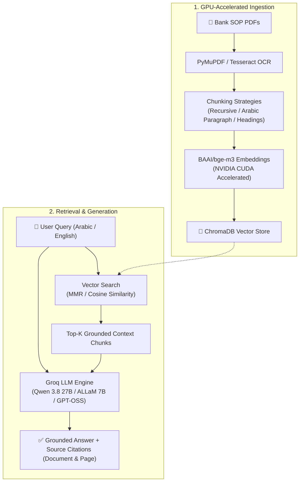

# 📄 Bank_Guide_AI — Bilingual Banking SOP Knowledge Assistant

<div align="center">

[](https://python.org)
[](https://langchain.com)
[](https://streamlit.io)
[](https://groq.com)
[](https://trychroma.com)
[](https://developer.nvidia.com/cuda-zone)

**An enterprise-grade, GPU-accelerated Retrieval-Augmented Generation (RAG) system tailored for internal banking Standard Operating Procedures (SOPs), manuals, and regulatory compliance documents in Arabic and English.**

</div>

---

## 🌟 Overview

**Bank_Guide_AI** empowers bank employees, auditors, and branch personnel to instantly search, verify, and understand complex banking procedures. The system bridges the gap between Arabic procedural documentation and bilingual queries, returning concise, structured answers backed by exact document and page citations.

### 📚 Ingested Knowledge Base
1. **Central Mail & Files Unit Procedures Manual** (`دليل إجراءات وحدة البريد المركزي والملفات`) — BPM workflows, credit file archiving, postal dispatches, inter-branch mail cycles.
2. **Central Alarm Tasks & Procedures Manual** (`دليل إجراءات وحدة الإنذار المركزي`) — Electronic access control cards/fines, CCTV footage extraction approvals, branch security protocols.
3. **Assets & Warehouse Operations Manual** (`دليل إجراءات وحدة الموجودات وعمليات المستودعات`) — FIFO storage policies, periodic physical inventory committees, fixed assets disposal/donations.

---

## 🏗️ Architecture & Workflow



---

## ✨ Key Features

- **⚡ GPU Acceleration (`CUDA`)**: Embeds hundreds of PDF pages in seconds using `BAAI/bge-m3` on NVIDIA GPUs with memory-safe batching.
- **🔍 OCR-Aware Extraction**: Automatically extracts native text layers with PyMuPDF and falls back to bilingual Tesseract OCR (`ara+eng`) for scanned pages or rasterized tables.
- **🧩 5 Interchangeable Chunking Strategies**:
  - `recursive_character`: Universal balanced default.
  - `arabic_paragraph`: Preserves Arabic numbered steps (`-1`, `-2`...).
  - `markdown_heading`: Keeps related procedural sections cohesive.
  - `character`: Fixed-size sliding window.
  - `token_based`: Matches token budgeting constraints.
- **🌐 Cross-Lingual & Grounded Answers**: Seamlessly translates Arabic procedure manuals to English answers (and vice versa) with zero hallucinations.
- **📚 Verified Source Attribution**: Displays exact document names, page numbers, extraction methods, and text snippets used for every response.
- **🖥️ Interactive Streamlit Interface**: Real-time LLM selection, chunking configuration, retrieval parameter tuning (top-k, MMR vs. Similarity), and chat history.

---

## 📁 Project Structure

```
Bank_Guide_AI/
├── config.py                 # Central configurations (paths, models, devices, thresholds)
├── app.py                    # Streamlit web application & UI
├── requirements.txt          # Python dependencies
├── .env.example              # Sample environment configuration
├── data/
│   └── pdfs/                 # Source banking PDF manuals
├── vectorstore/
│   ├── chroma_db/            # Chroma vector database (persisted)
│   └── ocr_cache/            # Document extraction cache
├── ingestion/
│   ├── ocr_loader.py         # PyMuPDF parser + Tesseract OCR fallback
│   ├── chunking.py           # 5 distinct chunking implementations
│   ├── embeddings.py         # GPU BGE-M3 embedding loader
│   └── ingest.py             # CLI and orchestrator for end-to-end ingestion
├── retrieval/
│   ├── vectorstore.py        # Vectorstore manager & batch writer
│   └── retriever.py          # Similarity and MMR search wrappers
└── generation/
    └── generator.py          # Groq chat completions + prompt formatting
```

---

## 🚀 Quickstart Guide

### 1. Prerequisites
- **Python 3.9+** (Conda or venv recommended)
- **Tesseract OCR** (Optional, for scanned PDFs):
  - **Windows**: [UB-Mannheim Tesseract installer](https://github.com/UB-Mannheim/tesseract/wiki) (select Arabic language pack during install).
  - **Linux**: `sudo apt-get install tesseract-ocr tesseract-ocr-ara`
  - **macOS**: `brew install tesseract tesseract-lang`

### 2. Installation
```bash
# Clone the repository
git clone https://github.com/AhmedEsam98/Bank_Guide_AI.git
cd Bank_Guide_AI

# Create and activate virtual environment
conda create -n bank_guide_env python=3.10 -y
conda activate bank_guide_env

# Install dependencies
pip install -r requirements.txt
```

### 3. Setup API Key
Create a `.env` file in the root directory:
```bash
cp .env.example .env
```
Add your [Groq API Key](https://console.groq.com):
```env
GROQ_API_KEY=gsk_your_groq_api_key_here
```

### 4. Run the Streamlit Application
```bash
streamlit run app.py
```

---

## 💻 CLI Ingestion (Headless)

You can also run ingestion directly from the command line:

```bash
python -m ingestion.ingest --strategy recursive_character --chunk-size 1000 --chunk-overlap 150
```

---

## 🧪 Example Test Queries

| Language | Question | Topic / Expected Answer |
| :--- | :--- | :--- |
| **English** | *What is the daily cut-off time for submitting outgoing mail requests through BPM?* | **1:30 PM** (*Central Mail Manual, Page 5*) |
| **Arabic** | *ما هي الغرامة المالية في حال فقدان بطاقة الدخول؟ ومتى يُعفى الموظف منها؟* | **10 دنانير**، ويُعفى للخلل الفني أو بعد عامين (*دليل الإنذار، ص 5*) |
| **English** | *What inventory dispatch method is used in the bank's warehouses?* | **FIFO (First-In, First-Out)** (*Assets Manual, Page 5*) |
| **Arabic** | *هل يجوز إرسال البطاقة المصرفية والرقم السري في شحنة بريدية واحدة للخارج؟* | **لا يجوز الجمع بينهما** في شحنة واحدة (*دليل البريد، ص 9*) |

---

## 🛠️ Tech Stack

- **Framework**: LangChain Core / LangChain Community / LangChain Groq / LangChain Chroma
- **Embeddings**: `BAAI/bge-m3` via HuggingFace / Sentence-Transformers (CUDA Accelerated)
- **Vector Store**: ChromaDB
- **LLM Provider**: Groq Cloud API (`qwen/qwen3.8-27b`, `allam-2-7b`, `openai/gpt-oss-120b`)
- **PDF & OCR**: PyMuPDF (`fitz`), Pillow, PyTesseract
- **UI Frontend**: Streamlit

---

## 📄 License
This project is open-source under the [MIT License](LICENSE).
